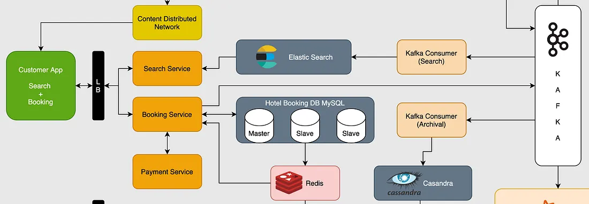

# Requirement Analysis in Software Development.

The Requirement Analysis Project focuses on crafting a comprehensive foundation for software development by documenting, analyzing, and structuring requirements. Create a detailed blueprint of the requirement analysis phase for a booking system, through a series of well-defined tasks.

## What is Requirement Analysis?

**Requirement Analysis is the process of identifying, gathering, and defining what a software system must do to meet user needs and business objectives. It involves communicating with stakeholders to understand functional and non-functional requirements, documenting them clearly, and validating their accuracy.**

### Importance in the SDLC:

- Ensures the final product aligns with user expectations.
- Prevents costly changes during later development stages.
- Improves project planning, estimation, and design accuracy.
- Serves as a foundation for testing and validation.
- Enhances communication between developers, clients, and stakeholders.

## Why is Requirement Analysis Important?

- **Prevents Misunderstandings:** Clearly defines what users need, reducing confusion and ensuring developers build the right system.

- **Saves Time and Cost:** Detects issues early before coding begins, avoiding expensive rework later in the project.

- **Improves Project Quality:** Provides a solid foundation for design, development, and testing, leading to a more reliable and user-focused product.

## Key Activities in Requirement Analysis.

- **Requirement Gathering:**
  Collecting all relevant information about what the system should do from stakeholders, users, and existing systems. It ensures that no critical need or expectation is missed.

- **Requirement Elicitation:**
  Using techniques like interviews, questionnaires, workshops, or brainstorming to draw out detailed requirements from stakeholders and uncover hidden or unclear needs.

- **Requirement Documentation:**
  Recording the gathered and elicited requirements in a structured form, such as a Software Requirement Specification, to provide a clear reference for developers and stakeholders.

- **Requirement Analysis and Modeling:**
  Examining and organizing requirements to identify conflicts, priorities, and dependencies. Models such as data flow diagrams or use case diagrams are created to visualize system behavior and structure.

- **Requirement Validation:**
  Reviewing and verifying requirements with stakeholders to ensure they are complete, correct, consistent, and achievable before moving to design and development.

## Types of Requirements.

### Functional Requirements

**Definition:** These are the specific behaviours and functions that the system must support — what the system does.

#### Examples in the booking-management project:

- The system allows users to search for available hotels by location, check-in / check-out date and room type.
  Medium

- The system lets hotel managers add, update, delete room types and inventory (e.g., number of rooms of a type for a date) for their property.

- The system supports booking/reservation creation, so that when a user chooses a room and date it records the reservation and updates inventory.

- The system enables users to cancel or modify bookings (subject to business rules) and the system adjusts availability accordingly.

- The system processes payments for bookings, and confirms the booking once payment is successful.

### Non-functional Requirements

**Definition:** These refer to the system’s qualities or constraints — how the system performs or what conditions it must satisfy (rather than what it does).

#### Examples in the booking-management project:

- The system should have low latency for search results (e.g., deliver search results within sub-second or under some threshold) to ensure good user experience.

- The system must be highly available and reliable, so that users can book hotels anytime and the booking service remains operational under high load.

- The system should prevent double-booking of the same room on the same date (i.e., concurrency control, data consistency) to maintain integrity of inventory.

- The system should scale to handle large numbers of users, hotels, and rooms (e.g., during peak travel periods) without performance degradation.

- The system must ensure security of user data (authentication, payment security), and data consistency (inventory counts correct) across services.

## Use Case Diagrams

Use Case Diagrams are visual representations in UML that show how users (actors) interact with a system to achieve specific goals. They outline the system’s main functions and the relationships between actors and use cases.

**Benefits:**

- Provide a clear overview of system functionality.
- Help identify user interactions and system boundaries.
- Improve communication between stakeholders and developers.
- Serve as a foundation for writing detailed use case descriptions and requirements.

## Acceptance Criteria

Acceptance criteria define the specific conditions a feature must meet to be considered complete and acceptable by stakeholders. They ensure clarity between developers, testers, and clients, prevent misunderstandings, and serve as a basis for validation and testing. Clearly defined criteria help maintain quality and confirm that user needs are fully met.

**Example – Checkout Feature (Booking Management System):**

- User must be able to review booking details before payment.
- System must calculate total cost including taxes and fees.
- Payment should be processed securely using approved gateways.
- A confirmation message and receipt must be displayed after successful payment.
- Booking status must update to “Confirmed” in the user’s account.
